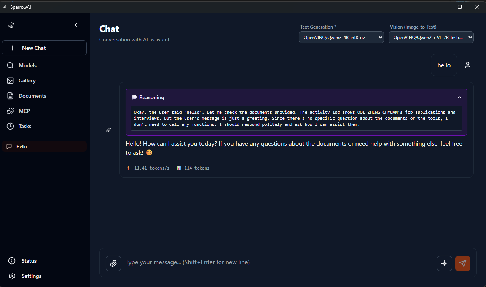
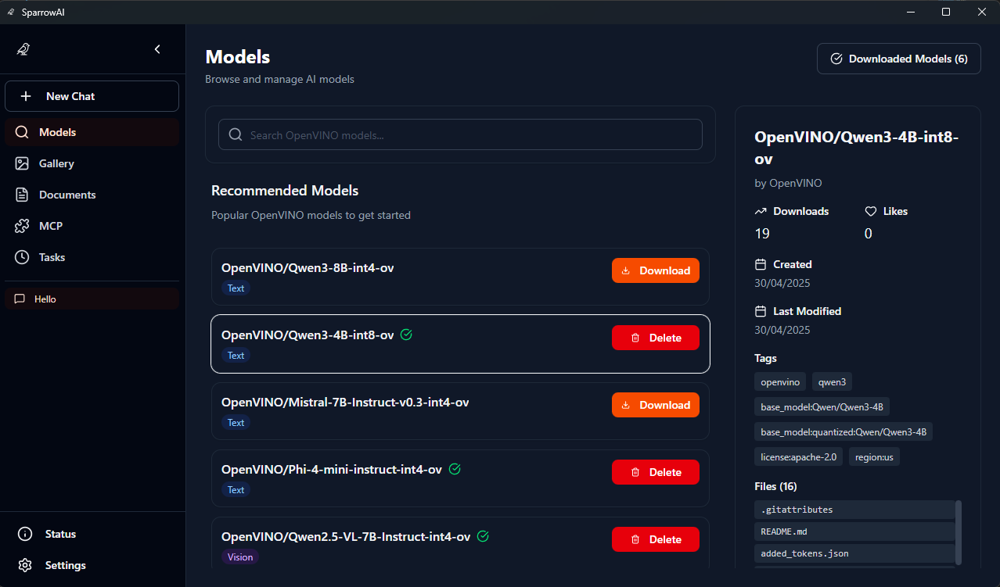
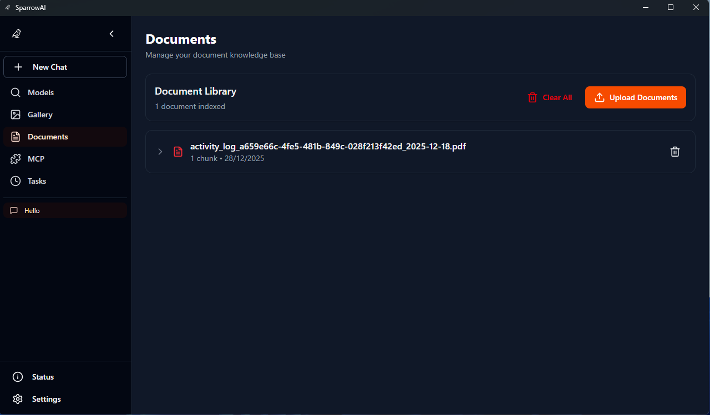
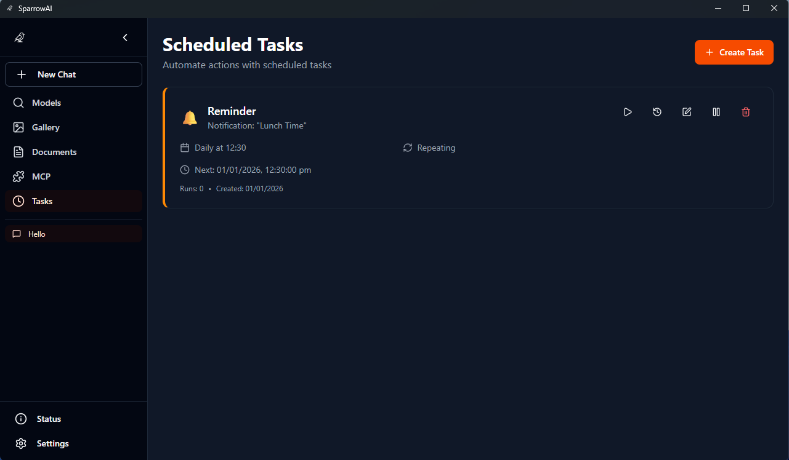
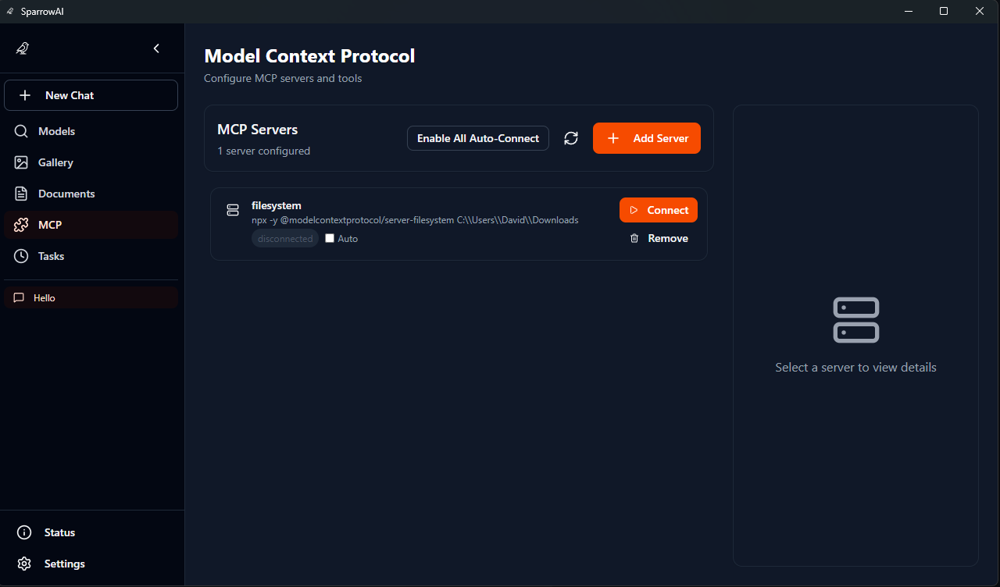
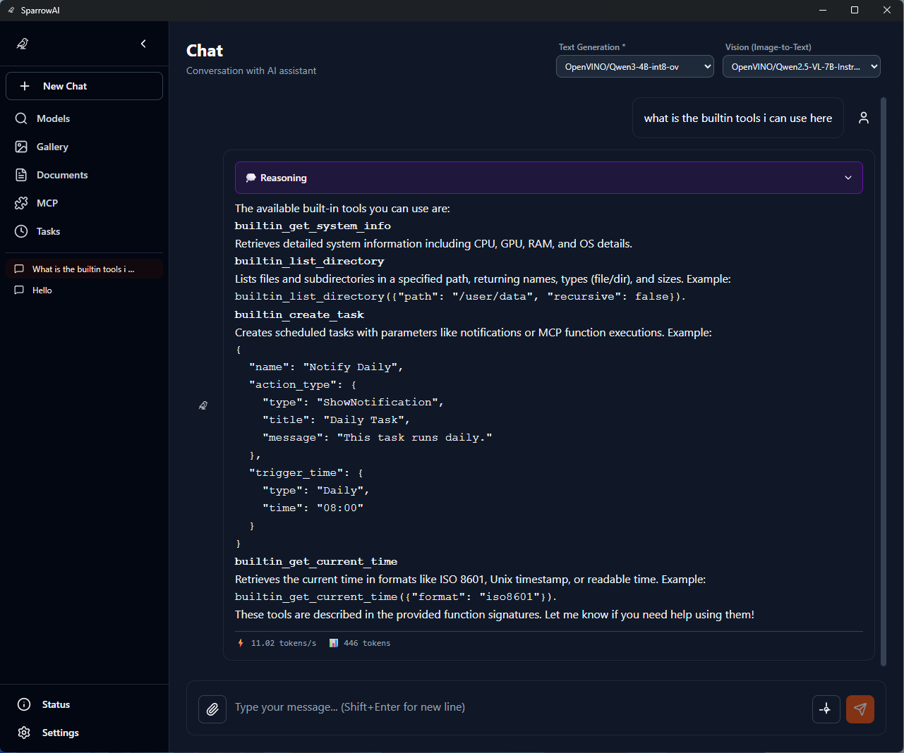
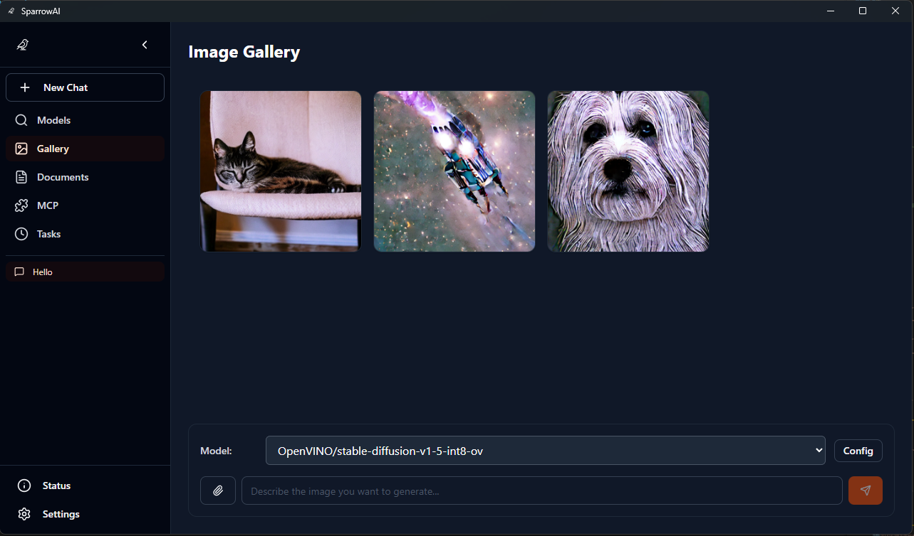

<div align="center">
  
  
  <p align="center">
    <strong>A powerful, privacy-first AI chat application</strong>
    <br />
    Built with Tauri, React, and OpenVINO Model Server(OVMS) for lightning-fast local AI inference on Intel AIPC
    <br />
    <br />
    <a href="#-quick-start"><strong>Get Started »</strong></a>
    ·
    <a href="#-features">Features</a>
    ·
    <a href="#-screenshots">Screenshots</a>
    ·
    <a href="https://github.com/zhengchy95/SparrowAI/issues">Report Bug</a>
    ·
    <a href="https://github.com/zhengchy95/SparrowAI/issues">Request Feature</a>
  </p>

  <p align="center">
    
   
   
    
    
  </p>
</div>

## 🚀 About SparrowAI

SparrowAI is a modern desktop application that brings powerful AI capabilities directly to your computer. Unlike cloud-based solutions, SparrowAI runs everything locally using Intel's OpenVINO Model Server for optimized performance, ensuring your conversations remain completely private.

### 🎯 Key Highlights

- **🔒 100% Local** - All processing happens on your device
- **⚡ Optimized Performance** - Powered by Intel OpenVINO for maximum efficiency
- **🧠 RAG Support** - Upload documents for context-aware conversations
- **⏰ Task Automation** - Schedule and automate tasks with flexible triggers
- **🔌 MCP Integration** - Extensible tool system with built-in and external MCP servers
- **🎨 Modern Interface** - Tailwind CSS v4 and custom UI components with dark/light themes

## ✨ Features

### ⚡ New in v0.5.0 release

- **⏰ Scheduled Tasks**: Create, edit, and run scheduled tasks (one-time or recurring) with flexible triggers:
  - Specific date/time (DateTime)
  - Daily, Weekly, Monthly schedules
  - Interval-based (every N minutes/hours)
  - Actions: Show notifications, run MCP functions
  - Auto-delete after execution option
  - Task execution history and logging
- **🔌 MCP Integration**: Full Model Context Protocol support with:
  - Multiple transport types: stdio, SSE (Server-Sent Events), HTTP
  - Auto-connect on startup for configured servers
  - Tool discovery and OpenAI-compatible function calling
  - Built-in MCP tools: system info, current time, directory listing, create_task
  - Custom MCP server management UI
- **🚀 Autostart**: Platform-aware autostart toggle to launch SparrowAI minimized on login
- **🎨 UI/UX Improvements**: Enhanced Gallery page for image generation, improved error handling
- **⚙️ OVMS Reliability**: Improved download, validation, extraction and config validation for robust local model server setup
- **🧪 Developer Tools**: `test-builtin-tools.js` for testing built-in tools and MCP functionality

### 💬 **Intelligent Conversations**

- Real-time streaming responses with performance metrics (tokens/second)
- Multi-session chat management with persistent history (UUID-based sessions)
- Customizable system prompts and generation parameters (temperature, top-p, max tokens)
- Context-aware conversations with optional conversation history
- Markdown rendering with KaTeX math support
- MCP (Model Context Protocol) tool integration:
  - Built-in tools: system info, time, directory listing, task creation
  - External MCP server support (stdio, SSE, HTTP transports)
  - OpenAI-compatible function calling for seamless tool integration

### 📚 **Document Intelligence (RAG)**

- Upload PDF, DOCX, XLSX files for enhanced context
- On-demand BGE embedding model download (no upfront installation)
- Automatic document processing and embedding generation
- Intelligent document chunking (1000 chars with 200 char overlap)
- Vector similarity search with reranking support
- File-based document management with expandable previews
- Sled-based vector store for efficient storage and retrieval

### ⏰ **Task Automation**

- Create scheduled tasks with flexible triggers:
  - One-time execution (specific date/time)
  - Recurring schedules (daily, weekly, monthly)
  - Interval-based (every N minutes/hours)
- Multiple action types:
  - Show desktop notifications
  - Execute MCP functions with custom arguments
- Task management UI with enable/disable toggles
- View task execution history and logs
- Natural language task creation via built-in `create_task` MCP tool
- Auto-delete option for one-time tasks
- Real-time event notifications for task execution

### 🤖 **Advanced Model Management**

- Browse and download models from Hugging Face Hub with search
- Support for multiple model categories:
  - Text generation (LLMs)
  - Image-to-text (vision models)
  - Image generation (diffusion models)
  - Speech-to-text, text-to-speech
  - Embeddings and rerankers
- On-demand BGE embedding model download for RAG
- Smart model pre-selection based on OVMS status
- Seamless model switching with automatic OVMS configuration updates
- Download progress tracking with pause/resume support
- Model validation and compatibility checking

### ⚡ **High-Performance Infrastructure**

- Intel OpenVINO Model Server 2025.4 integration
- Automatic OVMS download, extraction, and configuration
- Hardware acceleration support (CPU/GPU/NPU)
- Efficient memory management and resource optimization
- Asynchronous Rust backend with Tokio runtime
- ZIP archive validation and integrity checking
- Automatic config.json generation for loaded models
- Health check and status monitoring

### 🎨 **Polished User Experience**

- Tailwind CSS v4 + custom component library with smooth animations
- Collapsible sidebar with chat session management
- Real-time initialization progress tracking with status updates
- Comprehensive settings dialog:
  - System prompt customization
  - Generation parameters (temperature, top-p, tokens)
  - RAG enable/disable toggle
  - Autostart configuration
  - Theme customization (dark/light mode, accent colors)
- Error boundaries for graceful error handling
- Toast notifications for user feedback
- Responsive layout with modern UI components
- Lucide React icons throughout

## 📸 Screenshots

### 💬 Chat Interface



_Real-time streaming responses with markdown rendering, math support, and performance metrics_

### 🤖 Model Management



_Browse and download OpenVINO models from Hugging Face with category filtering_

### 📚 RAG Document Intelligence



_Upload and manage documents for context-aware conversations_

### ⏰ Task Scheduler



_Create and manage scheduled tasks with flexible triggers and actions_

### 🔌 MCP Integration



_Manage Model Context Protocol servers with multiple transport types_

### 🛠️ Built-in Tools



_Built-in MCP tools for system info, time, directory listing, and task creation_

### 🎨 Image Gallery



_Gallery view for generated images with metadata and management_

## 🚀 Quick Start

### Prerequisites

Make sure you have the following installed:

- **Node.js** 18+ ([Download](https://nodejs.org/))
- **Rust** latest stable ([Install](https://rustup.rs/))
- **pnpm** package manager (`npm install -g pnpm`)

### Installation

1. **Clone the repository**

   ```bash
   git clone https://github.com/DavidOzc/SparrowAI.git
   cd SparrowAI
   ```

2. **Install dependencies**

   ```bash
   pnpm install
   ```

3. **Run in development mode**

   ```bash
   pnpm tauri dev
   ```

4. **Build for production**
   ```bash
   pnpm tauri build
   ```

### First Launch

1. **Initialization** - SparrowAI will automatically:

   - Download and extract OpenVINO Model Server (OVMS)
   - Validate OVMS installation integrity
   - Create necessary configuration files
   - Initialize task scheduler engine
   - Register built-in MCP tools (system info, time, directory listing, create_task)
   - Set up logging infrastructure

2. **Download Models** - Visit the Models page to:

   - Browse Hugging Face OpenVINO models by category
   - Search for specific models
   - Download your preferred language models (int4 quantized recommended)
   - Models are stored in `~/.sparrow/models/OpenVINO/`
   - BGE embedding models download on-demand when accessing RAG features

3. **Configure Settings** (Optional):

   - Customize system prompts and generation parameters
   - Enable autostart to launch on login
   - Set up MCP servers for extended functionality
   - Toggle dark/light theme and accent colors

4. **Start Chatting** - Select a model and begin conversations with AI assistance!

## 🧠 Core Technologies

### Frontend Stack

- **React 19** - Modern UI with hooks and concurrent features
- **Tailwind CSS v4** - Utility-first styling and design system
- **Zustand v5** - Lightweight state management with persistence
- **TypeScript 5.9** - Static types for safety and better DX
- **Vite 7** - Lightning-fast development and builds
- **React Markdown** - Markdown rendering with KaTeX math support
- **Lucide React** - Beautiful and consistent icon system
- **class-variance-authority** - Type-safe variant API for components

### Backend Stack

- **Rust 2021 Edition** - Memory-safe systems programming
- **Tauri 2** - Secure desktop app framework with extensive plugin ecosystem
- **Tokio** - Asynchronous runtime for concurrent operations
- **OpenVINO Model Server 2025.4** - Optimized AI inference
- **Reqwest** - HTTP client for API calls and downloads
- **Serde** - Serialization/deserialization framework
- **Tracing** - Structured logging with file appenders

### AI & ML Stack

- **OpenVINO Model Server** - Intel's optimized AI inference engine
- **BGE Embeddings** - High-quality text embeddings for RAG
- **Sled** - Embedded key-value store for vector database
- **Document Processing**:
  - PDF extraction via `pdf-extract` and `lopdf`
  - DOCX support via `docx-rs`
  - Excel files via `calamine`
- **async-openai** - OpenAI-compatible API client (custom OVMS fork)
- **rmcp** - Model Context Protocol client library
- **nalgebra** - Linear algebra for vector operations (cosine similarity)
- **bincode** - Fast binary serialization for vector storage

## 📁 Project Structure

```
SparrowAI/
├── src/                      # React frontend (TypeScript)
│   ├── components/          # UI components
│   │   ├── chat/           # Chat interface components
│   │   ├── documents/      # RAG document management
│   │   ├── models/         # Model browser and downloads
│   │   ├── mcp/            # MCP server management UI
│   │   ├── tasks/          # Task scheduler UI
│   │   ├── gallery/        # Image generation gallery
│   │   ├── settings/       # Settings and dialogs
│   │   ├── layout/         # App layout components
│   │   └── ui/             # Reusable UI components
│   ├── store/              # Zustand state management
│   │   ├── slices/         # Feature-based state slices
│   │   ├── types.ts        # TypeScript type definitions
│   │   └── index.ts        # Store setup and hooks
│   ├── hooks/              # Custom React hooks
│   ├── lib/                # Utilities and helpers
│   └── types/              # Shared TypeScript types
├── src-tauri/              # Rust backend
│   ├── src/
│   │   ├── lib.rs          # Main library and commands
│   │   ├── main.rs         # Application entry point
│   │   ├── ovms.rs         # OVMS management
│   │   ├── chat.rs         # Chat session handling
│   │   ├── huggingface.rs  # Hugging Face Hub API
│   │   ├── tasks.rs        # Task scheduler engine
│   │   ├── autostart.rs    # Platform autostart logic
│   │   ├── logging.rs      # Tracing configuration
│   │   ├── mcp/            # MCP integration
│   │   │   ├── client.rs   # MCP client
│   │   │   ├── commands.rs # Tauri commands
│   │   │   ├── config.rs   # MCP config management
│   │   │   └── builtin_tools.rs # Built-in MCP tools
│   │   └── rag/            # RAG pipeline
│   │       ├── documents.rs    # Document processing
│   │       ├── embeddings.rs   # Embedding generation
│   │       ├── search.rs       # Vector search
│   │       ├── reranker.rs     # Result reranking
│   │       └── vector_store.rs # Sled vector DB
│   ├── capabilities/       # Tauri permissions
│   └── icons/              # Application icons
├── public/                 # Static assets
├── test-builtin-tools.js  # Developer testing script
└── README.md              # You are here!
```

## ⚙️ Configuration

### Data Directory

SparrowAI stores all data in your user profile:

- **Windows**: `%USERPROFILE%\.sparrow\`

### Directory Structure

```
.sparrow/
├── models/                 # Downloaded AI models
│   └── OpenVINO/          # OpenVINO optimized models (by category)
├── ovms/                  # Model server installation
│   ├── ovms.exe           # OVMS executable
│   └── config.json        # Auto-generated model config
├── vector_store/          # RAG vector database (Sled)
├── chat_sessions.json     # Conversation history
├── tasks.json             # Scheduled tasks configuration
├── mcp_config.json        # MCP server configurations
└── logs/                  # Application logs (tracing)
    ├── sparrow.log        # Current log file
    └── sparrow.log.YYYY-MM-DD # Archived logs
```

## 🎯 Usage Guide

### Model Recommendations

**Lightweight Models (1-4GB)** - Best for quick responses and limited hardware:

| Model                           | Size   | Speed  | Use Case                              |
| ------------------------------- | ------ | ------ | ------------------------------------- |
| `Qwen2.5-1.5B-Instruct-int4-ov` | ~1GB   | ⚡⚡⚡ | Ultra-fast, multilingual, basic tasks |
| `Phi-3.5-mini-instruct-int4-ov` | ~2GB   | ⚡⚡⚡ | Coding, reasoning, general chat       |
| `Qwen2.5-3B-Instruct-int4-ov`   | ~2GB   | ⚡⚡⚡ | Balanced performance, multilingual    |
| `gemma-2-2b-instruct-int4-ov`   | ~1.5GB | ⚡⚡⚡ | Fast inference, Google's lightweight  |

**Medium Models (4-8GB)** - Balanced performance and capability:

| Model                           | Size | Speed  | Use Case                       |
| ------------------------------- | ---- | ------ | ------------------------------ |
| `Qwen2.5-7B-Instruct-int4-ov`   | ~4GB | ⚡⚡   | Strong reasoning, multilingual |
| `Llama-3.2-3B-Instruct-int4-ov` | ~2GB | ⚡⚡⚡ | Meta's latest, efficient       |
| `Mistral-7B-Instruct-int4-ov`   | ~4GB | ⚡⚡   | Strong general performance     |

**Large Models (8GB+)** - Best quality for capable hardware:

| Model                           | Size  | Speed | Use Case                             |
| ------------------------------- | ----- | ----- | ------------------------------------ |
| `Llama-3.1-8B-Instruct-int4-ov` | ~5GB  | ⚡⚡  | Complex reasoning, long context      |
| `Qwen2.5-14B-Instruct-int4-ov`  | ~8GB  | ⚡    | Advanced tasks, high quality         |
| `Qwen2.5-32B-Instruct-int4-ov`  | ~18GB | ⚡    | Production-level quality (16GB+ RAM) |

**Specialized Models**:

- **Embeddings**: `Qwen3-Embedding-0.6B-int8-ov` (RAG, auto-downloaded when needed)
  - Alternative: `Qwen3-Embedding-0.6B-fp16-ov` for higher precision
- **Vision**: `Phi-3.5-vision-instruct-int4-ov`, `gemma-3-4b-it-int4-ov`, `InternVL2-1B-int4-ov`
- **Image Gen**: `stable-diffusion-v1-5-int8-ov`, `LCM_Dreamshaper_v7-int8-ov`

💡 **Tip**: Start with `Phi-3.5-mini` or `Qwen2.5-3B` for best balance. Always prefer `int4` quantized models for 4x faster inference on Intel hardware.

### RAG Document Support

Upload these document types for enhanced conversations:

- **PDF** - Research papers, books, manuals
- **DOCX** - Word documents, reports
- **XLSX** - Spreadsheets, data tables

### Advanced Settings

- **System Prompts** - Customize AI behavior and personality
- **Generation Parameters**:
  - Temperature (0.0-2.0) - Controls randomness
  - Top-p (0.0-1.0) - Nucleus sampling threshold
  - Max tokens - Response length limit
  - Seed - Reproducible generation
- **Conversation Settings**:
  - Include conversation history toggle
  - RAG enable/disable for document context
- **Autostart** - Launch on system startup (minimized option)
- **Theme** - Dark/light mode and accent color selection
- **Performance Monitoring** - Real-time tokens/second display during generation

## 🔧 Development

### Available Scripts

```bash
# Development
pnpm dev              # Start Vite dev server (port 1420)
pnpm tauri dev        # Launch Tauri development mode with hot reload

# Building
pnpm build           # Build frontend (TypeScript + Vite)
pnpm tauri build     # Create distributable app (.msi for Windows)

# Testing
cd src-tauri && cargo test    # Run Rust unit tests
cd src-tauri && cargo check   # Check Rust code without building
cd src-tauri && cargo clippy  # Run Rust linter

# Debugging
node test-builtin-tools.js    # Test built-in MCP tools
```

### Contributing Guidelines

We welcome contributions! Please:

1. **Fork** the repository
2. **Create** a feature branch: `git checkout -b feature/amazing-feature`
3. **Commit** your changes: `git commit -m 'Add amazing feature'`
4. **Push** to the branch: `git push origin feature/amazing-feature`
5. **Open** a Pull Request

### Code Standards

- Follow Rust formatting: `cargo fmt`
- Apply Javascript formatting with prettier default config
- Update documentation for new features

## 🔍 Troubleshooting

<details>
<summary><strong>🔧 Common Issues</strong></summary>

### OVMS Fails to Start

- Ensure Windows Defender/antivirus allows `ovms.exe`
- Check ports 1114-1115 are not in use by other applications
- Verify sufficient disk space (5GB+ recommended)
- Check logs in `~/.sparrow/logs/` for detailed error messages
- Try manually deleting `~/.sparrow/ovms/` and restarting to re-download

### Model Download Issues

- Check internet connection stability
- Verify Hugging Face Hub accessibility (not rate-limited)
- Try downloading smaller models first (1-2GB)
- Ensure sufficient disk space for model files
- Check `~/.sparrow/models/OpenVINO/` for partial downloads

### Performance Problems

- Monitor system resources (CPU/RAM/GPU usage)
- Use int4 quantized models for 4x faster inference
- Reduce `max_tokens` in settings (default: unlimited)
- Lower `temperature` for more deterministic responses
- Close unnecessary applications to free up memory
- Ensure OVMS is using hardware acceleration (check logs)

### RAG Not Working

- BGE models download on-demand when accessing Documents page
- Wait for embedding model download to complete
- Check document upload file formats (PDF, DOCX, XLSX only)
- Verify sufficient storage space for vector database
- Try smaller documents first (<10MB)
- Check if RAG is enabled in Settings dialog

### Task Scheduler Issues

- Ensure tasks are enabled (toggle switch)
- Check task logs for execution errors
- Verify MCP servers are connected for `RunMcpFunction` actions
- Check `~/.sparrow/tasks.json` for task configuration
- Tasks run in background - check notifications for results

### MCP Server Connection Fails

- Verify server executable path is correct
- Check server environment variables and arguments
- For SSE/HTTP servers, ensure URL is accessible
- Review MCP server logs for startup errors
- Try manual connection via MCP page UI

</details>

## 📊 Performance Metrics

| Metric                  | Typical Range      | Optimized Hardware |
| ----------------------- | ------------------ | ------------------ |
| **Startup Time**        | 3-5 seconds        | < 2 seconds        |
| **Memory Usage**        | 200MB + model size | 150MB + model size |
| **Inference Speed**     | 5-30 tokens/sec    | 20-100+ tokens/sec |
| **Document Processing** | 1-5 MB/sec         | 5-15 MB/sec        |

_Performance varies by hardware configuration and model size_

## 🔒 Privacy & Security

- **🏠 Local-First**: All processing happens on your device
- **🚫 No Telemetry**: Zero data collection or tracking
- **🔓 Open Source**: Complete transparency in code and behavior
- **🛡️ Secure**: Tauri's security model protects against vulnerabilities
- **📁 Data Control**: You own and control all conversations and documents

## 📄 License

This project is licensed under the **MIT License** - see the [LICENSE](LICENSE) file for details.

## 🙏 Acknowledgments

Special thanks to these incredible projects that make SparrowAI possible:

- **[Intel OpenVINO Model Server](https://github.com/openvinotoolkit/model_server)** - Local LLM Provider
- **[Tauri](https://tauri.app/)** - Secure cross-platform desktop framework
- **[Hugging Face](https://huggingface.co/)** - Democratizing access to AI models
- **[Material-UI](https://mui.com/)** - Beautiful React component library

---

<div align="center">
  
  **Built with ❤️ by the SparrowAI team**
  
  <p>
    <a href="https://github.com/zhengchy95/SparrowAI">⭐ Star on GitHub</a> •
    <a href="https://github.com/zhengchy95/SparrowAI/issues">🐛 Report Issues</a> •
    <a href="https://github.com/zhengchy95/SparrowAI/discussions">💬 Discussions</a>
  </p>
  
  <sub>Made possible by the open-source community 🌟</sub>
  
</div>
